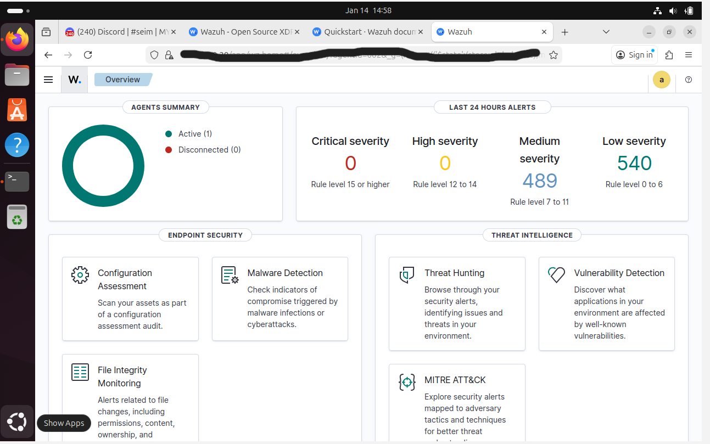
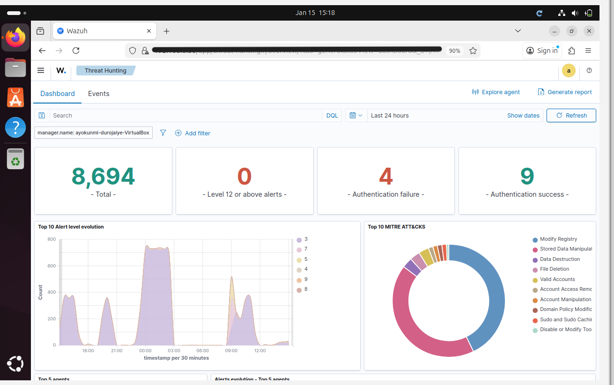
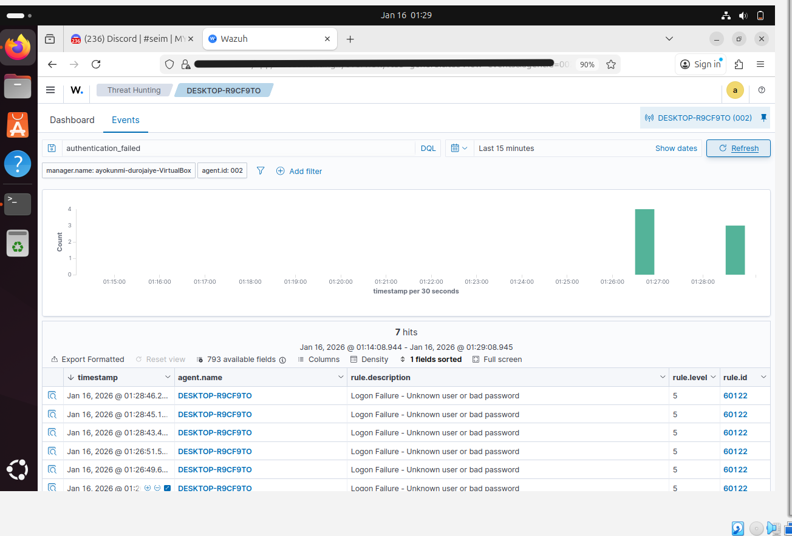
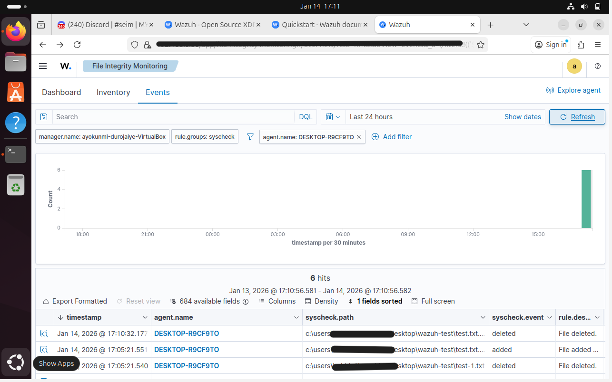

# SOC Home Lab – Wazuh SIEM

## Overview
This project documents the creation of a small, personal Security Operations Centre (SOC) style lab. The purpose of the lab was to understand what a day-to-day SOC analyst role looks like by monitoring system activity, reviewing alerts, and carrying out basic investigations in a realistic environment.

The focus was not on “hacking”, but on detection, monitoring, and analysis — the core responsibilities of a defensive security role.

---

## Goal
The goal of this project was to gain hands-on experience with how security monitoring works in practice. This included seeing how everyday activity on a computer can trigger alerts, how those alerts are displayed, and how an analyst decides what is important and what is not.

---

## Environment
- Linux virtual machine used as the central monitoring system  
- Windows virtual machine representing a typical user endpoint  
- Activity from the Windows system was collected and viewed from a single dashboard  

This setup mirrors how a SOC team monitors multiple systems from one place.

---

## What I Did
- Set up a security monitoring system and ensured it was running correctly  
- Connected a Windows system so its activity could be monitored  
- Confirmed that events from the Windows system were visible in the dashboard  
- Generated realistic activity such as failed login attempts and file changes  
- Observed how these actions were turned into alerts  
- Investigated alerts to understand what happened, when it happened, and where  
- Troubleshot issues to ensure alerts and logs were appearing reliably  

---

## Alerts & Investigation
During the lab, I triggered several types of security alerts, including:
- Repeated incorrect login attempts  
- File change activity  

I reviewed these alerts in the dashboard, examined their details, and used the available information to understand what caused them. This helped me practise reading alerts with context rather than treating them as isolated warnings.

---

## Key Takeaways
- A monitoring system can generate a large number of alerts, making prioritisation essential  
- Even small or accidental actions can trigger security events  
- Understanding normal behaviour is just as important as spotting suspicious behaviour  
- Effective SOC work is about investigation and decision-making, not just clearly tools  

---

## Screenshots

### SOC Dashboard Overview
This view shows the main security monitoring dashboard, providing a high-level summary of connected systems and alert activity.

---

### Alerts & Activity Overview (Triage View)
This view was used to review alert trends, authentication activity, and overall event volume to help prioritise what required investigation.

---

### Failed Login Investigation
This screenshot shows the investigation of repeated failed login attempts from a monitored Windows system, including timestamps, rule descriptions, and affected host details.

---

### File Integrity Monitoring (FIM) Investigation
This view demonstrates file integrity monitoring in action, showing files being added and deleted on the Windows endpoint and how these changes were detected and logged.

---

## Why This Project Matters
This project helped me build confidence in navigating a security monitoring environment and understand the thinking process behind incident response. It reflects the practical skills and mindset required for entry-level SOC and incident response roles.
